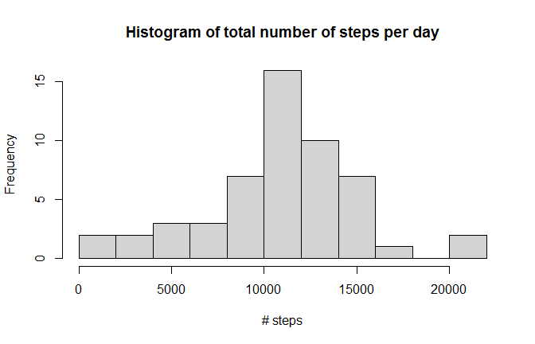
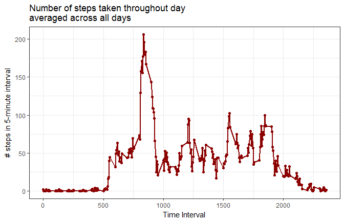
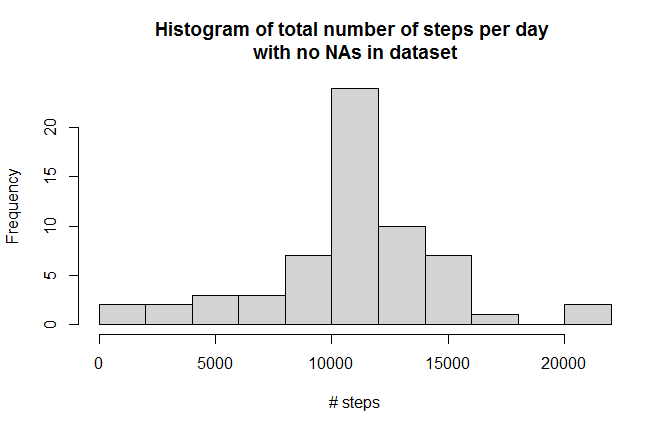
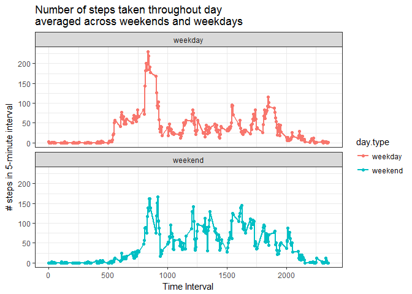

# Reproducible Research: Peer Assessment 1


## Loading and preprocessing the data

First I'll set the working directory, open up my favorite libraries, read in the dataset, and investigate it a little bit. I copied the dataset into the working directory.


```r
library(plyr)
library(dplyr)
library(ggplot2)
library(lubridate)
setwd("C:/Users/Kim/Desktop/coursera/reproducible_research/RepData_PeerAssessment1")
dat <- read.csv("activity.csv")
dim(dat)
```

```
## [1] 17568     3
```

```r
head(dat)
```

```
##   steps       date interval
## 1    NA 2012-10-01        0
## 2    NA 2012-10-01        5
## 3    NA 2012-10-01       10
## 4    NA 2012-10-01       15
## 5    NA 2012-10-01       20
## 6    NA 2012-10-01       25
```

```r
tail(dat)
```

```
##       steps       date interval
## 17563    NA 2012-11-30     2330
## 17564    NA 2012-11-30     2335
## 17565    NA 2012-11-30     2340
## 17566    NA 2012-11-30     2345
## 17567    NA 2012-11-30     2350
## 17568    NA 2012-11-30     2355
```

```r
summary(dat)
```

```
##      steps                date          interval     
##  Min.   :  0.00   2012-10-01:  288   Min.   :   0.0  
##  1st Qu.:  0.00   2012-10-02:  288   1st Qu.: 588.8  
##  Median :  0.00   2012-10-03:  288   Median :1177.5  
##  Mean   : 37.38   2012-10-04:  288   Mean   :1177.5  
##  3rd Qu.: 12.00   2012-10-05:  288   3rd Qu.:1766.2  
##  Max.   :806.00   2012-10-06:  288   Max.   :2355.0  
##  NA's   :2304     (Other)   :15840
```

```r
str(dat)
```

```
## 'data.frame':	17568 obs. of  3 variables:
##  $ steps   : int  NA NA NA NA NA NA NA NA NA NA ...
##  $ date    : Factor w/ 61 levels "2012-10-01","2012-10-02",..: 1 1 1 1 1 1 1 1 1 1 ...
##  $ interval: int  0 5 10 15 20 25 30 35 40 45 ...
```

Date was read in as a factor. I'll use the _lubridate_ package to turn it into a date. 


```r
dat$date <- ymd(dat$date)
# make sure it worked
class(dat$date)
```

```
## [1] "Date"
```


## What is mean total number of steps taken per day?

To calculate mean total number of steps per day, I will:

1. Use _dplyr_ to group the data frame by date  
2. Create a new dataframe of sums  
3. Investigate the distribution of daily totals using a histogram  
4. Calculate the mean and median of these values. The assignment instructions said to ignore NAs, so I will set `na.rm=TRUE` for these functions.  


```r
byday <- dat %>%
    group_by(date) %>%
    summarize(steps.total = sum(steps))

# check it
head(byday)
```

```
## # A tibble: 6 × 2
##         date steps.total
##       <date>       <int>
## 1 2012-10-01          NA
## 2 2012-10-02         126
## 3 2012-10-03       11352
## 4 2012-10-04       12116
## 5 2012-10-05       13294
## 6 2012-10-06       15420
```

```r
summary(byday)
```

```
##       date             steps.total   
##  Min.   :2012-10-01   Min.   :   41  
##  1st Qu.:2012-10-16   1st Qu.: 8841  
##  Median :2012-10-31   Median :10765  
##  Mean   :2012-10-31   Mean   :10766  
##  3rd Qu.:2012-11-15   3rd Qu.:13294  
##  Max.   :2012-11-30   Max.   :21194  
##                       NA's   :8
```

```r
hist(byday$steps.total, col="lightgray",
     breaks=10,
     main="Histogram of total number of steps per day",
     xlab="# steps")
```

<!-- -->


__Calculating the mean and median:__


```r
mean(byday$steps.total, na.rm=TRUE)
```

```
## [1] 10766.19
```

```r
median(byday$steps.total, na.rm=TRUE)
```

```
## [1] 10765
```

The mean and median are almost identical.  


## What is the average daily activity pattern?

For this portion, we want to look at each 5-minute interval, averaged across all days. So I want to use _dplyr_ to make a data frame of average # of steps by interval.


```r
byint <- dat %>%
    group_by(interval) %>%
    summarize(steps.int = mean(steps, na.rm=TRUE))

# check it
head(byint)
```

```
## # A tibble: 6 × 2
##   interval steps.int
##      <int>     <dbl>
## 1        0 1.7169811
## 2        5 0.3396226
## 3       10 0.1320755
## 4       15 0.1509434
## 5       20 0.0754717
## 6       25 2.0943396
```

```r
dim(byint)
```

```
## [1] 288   2
```

```r
summary(byint)
```

```
##     interval        steps.int      
##  Min.   :   0.0   Min.   :  0.000  
##  1st Qu.: 588.8   1st Qu.:  2.486  
##  Median :1177.5   Median : 34.113  
##  Mean   :1177.5   Mean   : 37.383  
##  3rd Qu.:1766.2   3rd Qu.: 52.835  
##  Max.   :2355.0   Max.   :206.170
```

Now to make a plot:


```r
ggplot(byint, aes(x=interval, y=steps.int)) +
    geom_line(col="darkred", lwd=1) +
    geom_point(col="darkred") +
    theme_bw() +
    ggtitle("Number of steps taken throughout day \naveraged across all days") +
    xlab("Time Interval") +
    ylab("# steps in 5-minute interval")
```

<!-- -->

Looks like the interval with the highest number of steps is in the morning. Let's find out:


```r
highest <- filter(byint, steps.int == max(steps.int))
```


The interval with the maximum number of steps is `highest$interval`, __835__, with an average of `highest$steps.int`, __206.1698113__ steps.


## Imputing missing values

How many missing values are in the dataset overall?


```r
sum(is.na(dat$steps))
```

```
## [1] 2304
```

Fill in missing values. I'll use the overall mean for the time interval.


```r
# create a new column. if steps is not NA, use that value. else, replace the NA with mean from byint, where byint$interval == dat$interval

dat$steps.imputed <- ifelse(!is.na(dat$steps), dat$steps, 
                            byint$steps.int[byint$interval %in% dat$interval])

# see if that worked; first few rows of steps.imputed should match first few rows of byint$steps.int
head(dat)
```

```
##   steps       date interval steps.imputed
## 1    NA 2012-10-01        0     1.7169811
## 2    NA 2012-10-01        5     0.3396226
## 3    NA 2012-10-01       10     0.1320755
## 4    NA 2012-10-01       15     0.1509434
## 5    NA 2012-10-01       20     0.0754717
## 6    NA 2012-10-01       25     2.0943396
```

```r
head(byint)
```

```
## # A tibble: 6 × 2
##   interval steps.int
##      <int>     <dbl>
## 1        0 1.7169811
## 2        5 0.3396226
## 3       10 0.1320755
## 4       15 0.1509434
## 5       20 0.0754717
## 6       25 2.0943396
```

```r
# last few rows should match too
tail(dat)
```

```
##       steps       date interval steps.imputed
## 17563    NA 2012-11-30     2330     2.6037736
## 17564    NA 2012-11-30     2335     4.6981132
## 17565    NA 2012-11-30     2340     3.3018868
## 17566    NA 2012-11-30     2345     0.6415094
## 17567    NA 2012-11-30     2350     0.2264151
## 17568    NA 2012-11-30     2355     1.0754717
```

```r
tail(byint)
```

```
## # A tibble: 6 × 2
##   interval steps.int
##      <int>     <dbl>
## 1     2330 2.6037736
## 2     2335 4.6981132
## 3     2340 3.3018868
## 4     2345 0.6415094
## 5     2350 0.2264151
## 6     2355 1.0754717
```

```r
#make sure all NAs are gone; this should be 0:
sum(is.na(dat$steps.imputed))
```

```
## [1] 0
```

Instructions say to make a whole new data frame for this that looks the same as the original, but without NAs.


```r
dat2 <- dat %>%
    mutate(steps = steps.imputed) %>%
    select(-steps.imputed)

# make sure that looks right
head(dat2)
```

```
##       steps       date interval
## 1 1.7169811 2012-10-01        0
## 2 0.3396226 2012-10-01        5
## 3 0.1320755 2012-10-01       10
## 4 0.1509434 2012-10-01       15
## 5 0.0754717 2012-10-01       20
## 6 2.0943396 2012-10-01       25
```

```r
tail(dat2)
```

```
##           steps       date interval
## 17563 2.6037736 2012-11-30     2330
## 17564 4.6981132 2012-11-30     2335
## 17565 3.3018868 2012-11-30     2340
## 17566 0.6415094 2012-11-30     2345
## 17567 0.2264151 2012-11-30     2350
## 17568 1.0754717 2012-11-30     2355
```


I'll do the same thing as above to group the dataset by date, make a histogram of number of steps per day, and calculate the mean and median.


```r
byday2 <- dat2 %>%
    group_by(date) %>%
    summarize(steps.total = sum(steps))

# check it
head(byday2)
```

```
## # A tibble: 6 × 2
##         date steps.total
##       <date>       <dbl>
## 1 2012-10-01    10766.19
## 2 2012-10-02      126.00
## 3 2012-10-03    11352.00
## 4 2012-10-04    12116.00
## 5 2012-10-05    13294.00
## 6 2012-10-06    15420.00
```

```r
summary(byday2)
```

```
##       date             steps.total   
##  Min.   :2012-10-01   Min.   :   41  
##  1st Qu.:2012-10-16   1st Qu.: 9819  
##  Median :2012-10-31   Median :10766  
##  Mean   :2012-10-31   Mean   :10766  
##  3rd Qu.:2012-11-15   3rd Qu.:12811  
##  Max.   :2012-11-30   Max.   :21194
```

```r
hist(byday2$steps.total, col="lightgray",
     breaks=10,
     main="Histogram of total number of steps per day \nwith no NAs in dataset",
     xlab="# steps")
```

<!-- -->

__Calculating the mean and median:__


```r
mean(byday2$steps.total)
```

```
## [1] 10766.19
```

```r
median(byday2$steps.total)
```

```
## [1] 10766.19
```

The mean is exactly the same as above, and now the median is exactly the same as the mean. Replacing missing values with means changed the median. Not by much, but a little bit. It didn't change the shape of the histogram much, but it did increase the frequency of the 10000 bin and made it slightly taller and narrower of a distribution.


## Are there differences in activity patterns between weekdays and weekends?

Now to make a column for weekday/weekend, then make a plot of steps per time interval split by weekday vs. weekend.


```r
dat2$weekday <- wday(dat2$date, label=TRUE)
dat2$day.type <- factor(ifelse(dat2$weekday %in% c("Sun", "Sat"), "weekend", "weekday"))

# make sure that worked
table(dat2$weekday, dat2$day.type)
```

```
##        
##         weekday weekend
##   Sun         0    2304
##   Mon      2592       0
##   Tues     2592       0
##   Wed      2592       0
##   Thurs    2592       0
##   Fri      2592       0
##   Sat         0    2304
```

```r
# calculate averages by day type and interval
byint2 <- dat2 %>%
    group_by(day.type, interval) %>%
    summarize(steps.int = mean(steps, na.rm=TRUE))

ggplot(byint2, aes(x=interval, y=steps.int, col=day.type)) +
    geom_line(lwd=1) +
    geom_point() +
    facet_wrap(~day.type, ncol=1) +
    theme_bw() +
    ggtitle("Number of steps taken throughout day \naveraged across weekends and weekdays") +
    xlab("Time Interval") +
    ylab("# steps in 5-minute interval")
```

<!-- -->

Looks like there are differences in walking patterns between weekdays and weekends. The weekend doesn't contain a big spike at 8:35 am like weekdays do, and the number of steps throughout the day seems more evenly distributed. The test subject also starts walking later in the day on weekends, so presumably wakes up later, and also goes to bed later.
